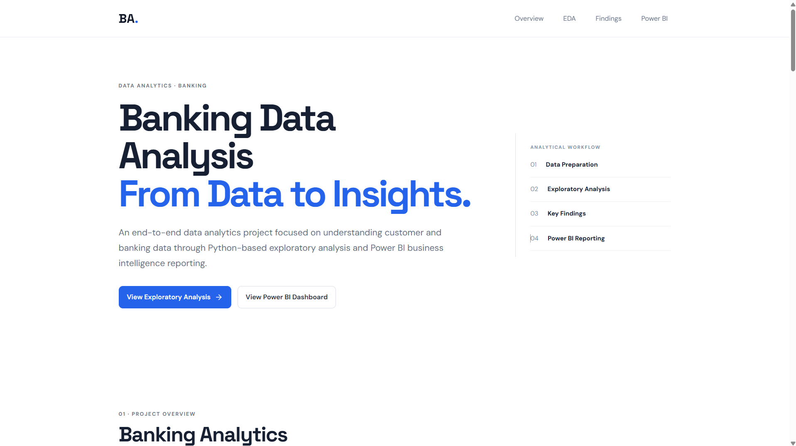
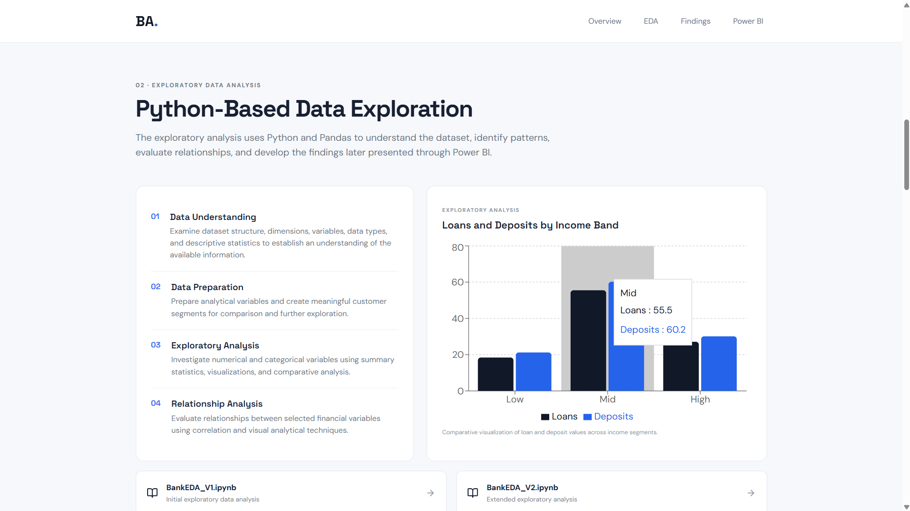
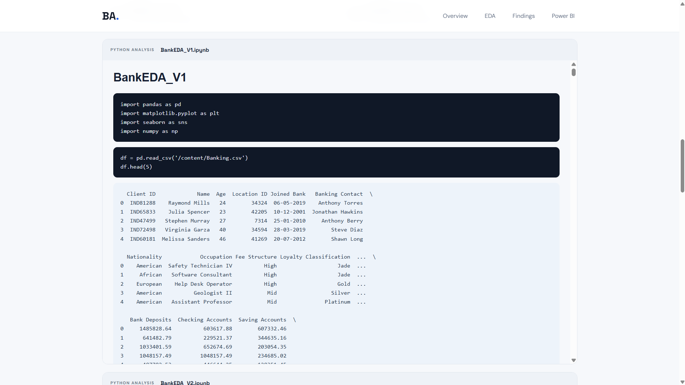
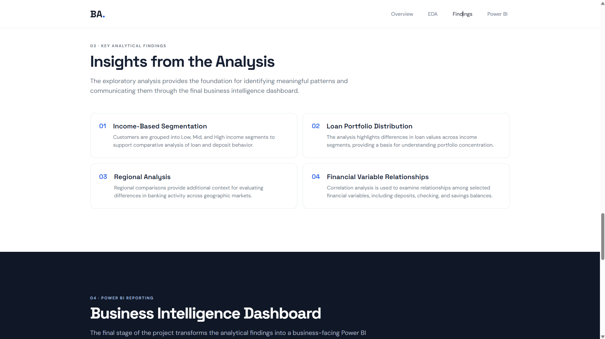
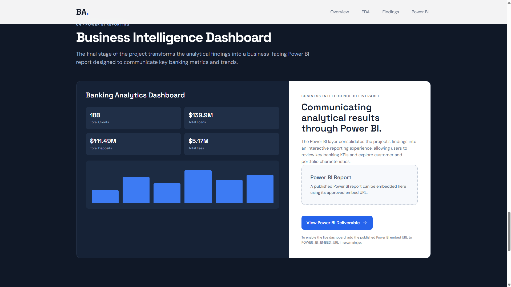
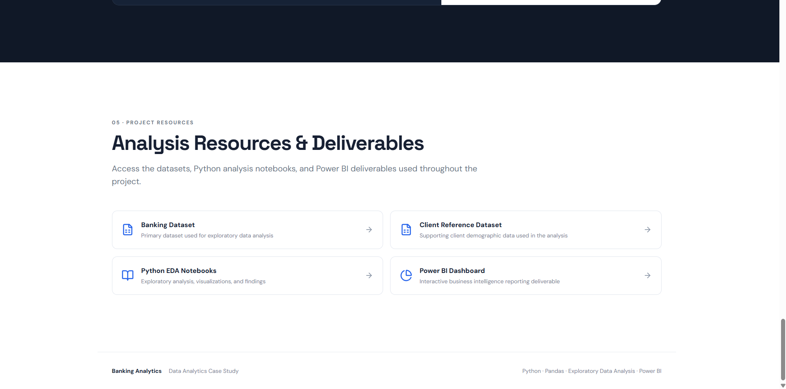

Absolutely bro. The main issue is that your screenshot headings currently have **no actual image Markdown/HTML underneath them**, and some GitHub links were accidentally converted into Google search URLs.

Here is the **clean final README** in the same style as your NeuroBrief README, with all 6 images correctly connected to your `assets` folder.

````markdown
# 🏦 Banking Data Analytics Dashboard

> **End-to-end data analytics and business intelligence project built by Aniket Agvane.**

Banking Data Analytics Dashboard is an end-to-end analytics project that transforms raw banking data into meaningful business insights using **Python, Exploratory Data Analysis (EDA), and Microsoft Power BI**.

The project also includes a **React + Vite web showcase** that presents the complete analytical workflow, insights, dashboards, and project documentation in an interactive interface.

---

## 🔗 Project Links

- **Live Project:** https://banking-data-analytics-dashboard.vercel.app/
- **GitHub Repository:** https://github.com/aniketagvane3232/Banking-Data-Analytics-Dashboard

---

## ✨ Features

- 📊 **Banking Data Analysis** — analyze financial metrics, account types, transactions, and performance trends.
- 👥 **Customer Behavioral Analytics** — explore customer patterns, demographics, activity, and behavior.
- 💳 **Transaction Analysis** — analyze transaction volumes, frequencies, and trends across different segments.
- 🐍 **Python EDA Workflow** — perform data cleaning, exploration, statistical analysis, and visualization using Python.
- 📈 **Interactive Power BI Dashboard** — transform analytical findings into interactive reports and KPIs.
- 🌐 **React Web Showcase** — present the complete analytics project through a modern web interface.
- 📓 **Jupyter Notebooks** — document the complete exploratory data analysis workflow.
- 📱 **Responsive Interface** — provide a clean and accessible project presentation.

---

## 🛠️ Tech Stack

### Data Analytics

- Python
- Jupyter Notebook
- Pandas
- NumPy
- Matplotlib
- Exploratory Data Analysis

### Business Intelligence

- Microsoft Power BI
- KPI Modeling
- Data Visualization
- Business Intelligence
- Data Storytelling

### Frontend

- React
- JavaScript
- Vite
- HTML5
- CSS3

### Deployment & Version Control

- Vercel
- Git
- GitHub

---

## 🏗️ Project Architecture

The complete project follows this analytics pipeline:

**Banking Dataset → Data Cleaning → Python EDA → Business Insights → Power BI Dashboard → React Web Showcase**

```text
┌─────────────────────┐
│   Banking Dataset   │
└──────────┬──────────┘
           │
           ▼
┌─────────────────────┐
│   Data Cleaning     │
│   & Preparation     │
└──────────┬──────────┘
           │
           ▼
┌──────────────────────┐
│      Python EDA      │
│  Pandas / NumPy      │
│  Matplotlib / Stats  │
└──────────┬───────────┘
           │
           ▼
┌─────────────────────┐
│   Business Insights │
│       & KPIs        │
└──────────┬──────────┘
           │
           ▼
┌─────────────────────┐
│      Power BI       │
│ Interactive Reports │
│     & Dashboards    │
└──────────┬──────────┘
           │
           ▼
┌─────────────────────┐
│   React Web App     │
│   Project Showcase  │
└─────────────────────┘
````

---

## 🔄 Analytics Workflow

### 1. 📥 Banking Dataset

The banking dataset is used as the foundation for the project.

### 2. 🧹 Data Cleaning

Raw data is prepared, cleaned, and structured before analysis.

### 3. 🐍 Python Exploratory Data Analysis

Python and Jupyter Notebook are used to explore the dataset and identify important patterns.

The analysis covers areas such as:

* Customer behavior
* Account information
* Transaction activity
* Financial trends
* Data distributions
* Business patterns

### 4. 💡 Business Insights

The results of the exploratory analysis are converted into meaningful business findings and KPIs.

### 5. 📊 Power BI

Power BI is used to transform analytical findings into interactive dashboards and business reports.

### 6. 🌐 Web Showcase

The complete project is presented through a React/Vite-based web application.

---

# 📸 Project Screenshots

## 📊 Dashboard Overview

<p align="center">
  
</p>

---

## 📈 Banking Analytics

<p align="center">
  
</p>

---

## 👥 Customer Insights

<p align="center">
  
</p>

---

## 💳 Transaction Analysis

<p align="center">
  
</p>

---

## 💰 Financial Analysis

<p align="center">
  
</p>

---

## 📊 Final Dashboard

<p align="center">
  
</p>

---

# 🐍 Python Exploratory Data Analysis

Python is used to perform the exploratory data analysis workflow.

The EDA process includes:

* Data understanding
* Data cleaning
* Data preparation
* Statistical exploration
* Customer analysis
* Transaction analysis
* Financial analysis
* Data visualization
* Business insight generation

### EDA Flow

```text
Raw Banking Data
       │
       ▼
Data Understanding
       │
       ▼
Data Cleaning
       │
       ▼
Exploratory Analysis
       │
       ▼
Data Visualization
       │
       ▼
Business Insights
```

---

# 📈 Power BI Dashboard

Microsoft Power BI is used to convert analytical findings into interactive business intelligence dashboards.

The dashboard focuses on:

* 📌 Key Performance Indicators
* 👥 Customer insights
* 💳 Transaction trends
* 💰 Financial metrics
* 📊 Banking performance
* 🔎 Interactive analysis

Power BI provides the business intelligence layer of the project and helps convert raw analytical results into an easy-to-understand visual format.

---

# 🚀 Getting Started

## Prerequisites

Make sure you have the following installed:

* Git
* Python 3.8+
* Node.js
* npm
* Jupyter Notebook
* Microsoft Power BI Desktop *(optional — required for editing `.pbix` files)*

---

## 1️⃣ Clone the Repository

```bash
git clone https://github.com/aniketagvane3232/Banking-Data-Analytics-Dashboard.git

cd Banking-Data-Analytics-Dashboard
```

---

## 2️⃣ Create Python Virtual Environment

```bash
python -m venv venv
```

### Windows

```powershell
venv\Scripts\activate
```

### macOS / Linux

```bash
source venv/bin/activate
```

---

## 3️⃣ Install Python Dependencies

```bash
pip install pandas numpy matplotlib jupyter
```

---

## 4️⃣ Start Jupyter Notebook

```bash
jupyter notebook
```

Open the notebooks available inside the `notebooks` directory.

---

# ⚛️ Run the React Web Application

Navigate to the frontend directory:

```bash
cd frontend
```

Install dependencies:

```bash
npm install
```

Start the development server:

```bash
npm run dev
```

The application will be available at the local Vite URL shown in your terminal.

Usually:

```text
http://localhost:5173
```

---

# 📁 Project Structure

```text
Banking-Data-Analytics-Dashboard/
│
├── assets/
│   ├── 1.png
│   ├── 2.png
│   ├── 3.png
│   ├── 4.png
│   ├── 5.png
│   └── 6.png
│
├── data/
│   └── Banking Dataset
│
├── frontend/
│   ├── public/
│   ├── src/
│   ├── package.json
│   └── ...
│
├── notebooks/
│   ├── BankEDA_V1.ipynb
│   ├── BankEDA_V2.ipynb
│   └── ...
│
├── powerbi/
│   └── Power BI Reports
│
├── whole Project data/
│
├── .gitignore
├── PROJECT_ASSETS.txt
└── README.md
```

> The project structure may evolve as new analytics, dashboards, and features are added.

---

# 🎯 Project Goals

The primary goal of this project is to demonstrate a complete data analytics and business intelligence workflow.

The project focuses on:

1. 📥 Collecting banking data
2. 🧹 Cleaning and preparing the dataset
3. 🐍 Performing exploratory data analysis
4. 📊 Identifying important patterns
5. 💡 Generating business insights
6. 📌 Creating meaningful KPIs
7. 📈 Building interactive Power BI dashboards
8. 🌐 Presenting the complete project through a web application

---

# 💡 Key Learning Areas

This project demonstrates practical experience with:

* Data Cleaning
* Exploratory Data Analysis
* Python
* Pandas
* NumPy
* Matplotlib
* Jupyter Notebook
* Banking Analytics
* Customer Analytics
* Transaction Analytics
* Financial Analytics
* Business Intelligence
* Power BI
* KPI Development
* Data Visualization
* Data Storytelling
* Dashboard Design
* React
* Vite
* Web Deployment

---

# 🌐 Live Application

### 🚀 Try the Project

**[https://banking-data-analytics-dashboard.vercel.app/](https://banking-data-analytics-dashboard.vercel.app/)**

### 💻 Source Code

**[https://github.com/aniketagvane3232/Banking-Data-Analytics-Dashboard](https://github.com/aniketagvane3232/Banking-Data-Analytics-Dashboard)**

---

# 👨‍💻 Author

## Aniket Agvane

Built and maintained by **Aniket Agvane**.

* **GitHub:** [https://github.com/aniketagvane3232](https://github.com/aniketagvane3232)
* **Project:** [https://github.com/aniketagvane3232/Banking-Data-Analytics-Dashboard](https://github.com/aniketagvane3232/Banking-Data-Analytics-Dashboard)
* **Live Project:** [https://banking-data-analytics-dashboard.vercel.app/](https://banking-data-analytics-dashboard.vercel.app/)

---

# 🤝 Contributing

Contributions, issues, and feature requests are welcome!

### Contribution Steps

```bash
# Fork the repository

# Clone your fork
git clone YOUR_FORK_URL

# Create a feature branch
git checkout -b feature/AmazingFeature

# Make your changes

# Stage changes
git add .

# Commit changes
git commit -m "Add AmazingFeature"

# Push the branch
git push origin feature/AmazingFeature
```

Then open a Pull Request.

---

# ⭐ Support

If you like **Banking Data Analytics Dashboard**, consider giving the repository a ⭐ on GitHub.

Your support is appreciated! ❤️

---

## 🚀 Built with passion by Aniket Agvane


````

So once you commit the `assets` folder along with this README, GitHub will render all six screenshots automatically.
